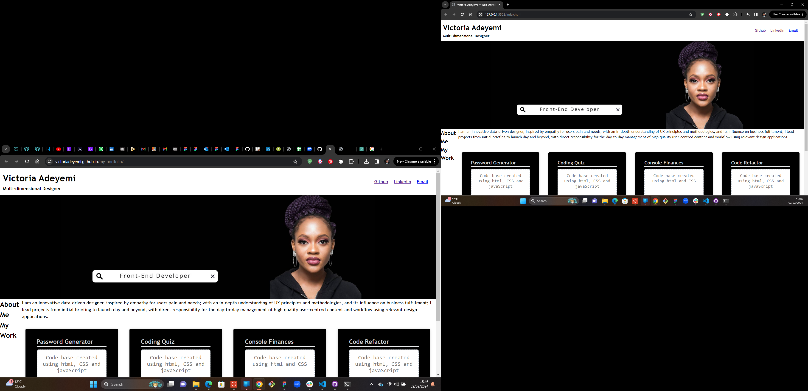

# Unit 2 Challenge: Portfolio

Created html file. 
Created a header for name and description.
Created a list with links for users to contact me.
Created hero banner to include picture and designation.
Created sections for about me and my work. 
Added a brief text about me.
Created cards to display my work links.

Created CSS to style all the html properties.

Refactored the code base appropriately.

URL of deployed application: 
URL of Github repository: https://github.com/victoriadeyemi/my-portfolio
Screenshot of deployed application: 

